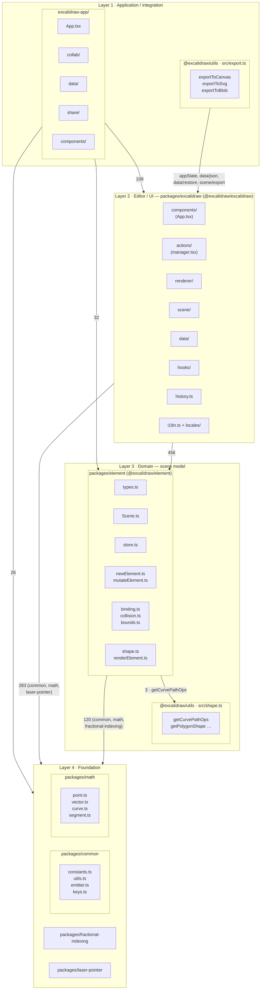
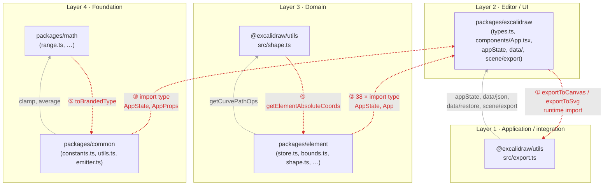
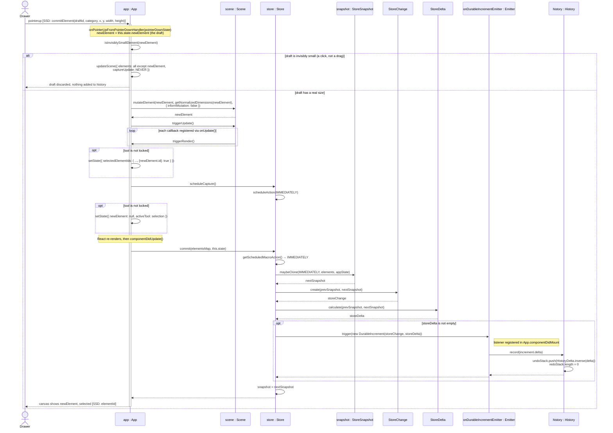
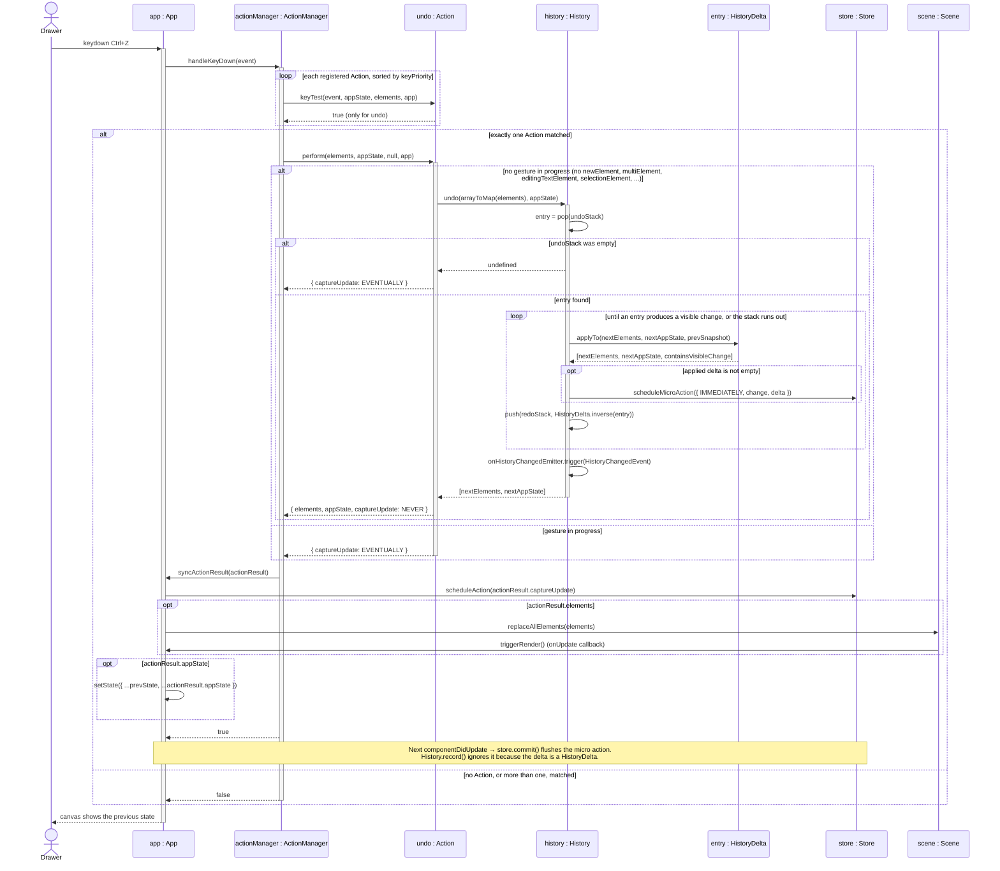

# Logical Architecture

Repository analyzed: `github.com/mendozaa0130/excalidraw` (fork of `excalidraw/excalidraw`). This page covers:

1. The **logical** architecture: how the code is organized into layers and packages, and which way the dependencies point. It says nothing about deployment (browsers, servers, Firebase).
2. Two interaction diagrams that open up the system, one of which expands a system event from [SSDs and Operation Contracts](ssds-and-operation-contracts.md).
3. One architectural concern, with evidence.
4. GRASP patterns applied well and violated.

Every participant in the interaction diagrams is a class (or, for `undo : Action`, an object implementing an interface) that can be opened at the path listed in the diagram's source comments.

## Architectural Style

Logically, Excalidraw follows a layered architecture, though not a strict one. Its layers are the Yarn-workspace packages, and their imports point downward. `packages/math` and `packages/common` form the foundation, providing geometry primitives, constants, utilities and the generic `Emitter`. `packages/element` is the domain layer, containing the element types, `Scene.ts`, `store.ts`, `mutateElement.ts`, binding and collision; it imports `common` 68 times and `math` 51 times. `packages/excalidraw` is the editor/UI layer, with `components/` (including `App.tsx`), `actions/`, `renderer/`, `scene/`, `data/` and `history.ts`. It imports `element` 456 times and `common`/`math` 279 times. `excalidraw-app/` is the application layer, organized into `collab/`, `data/`, `share/` and `components/`, and imports the editor 109 times. (All counts are `import` statements in non-test code.) Two design choices inside these layers keep dependencies pointing down. First, `history.ts` imports `Store` from `@excalidraw/element`, but `store.ts` never imports `History`; both depend on `Emitter` from `common`. Second, `actions/manager.tsx` depends only on the `Action` interface in `actions/types.ts`, not on any of the 36 concrete `action*.ts(x)` files. The layering is leaky in five places, shown in the second diagram. `element` refers to `@excalidraw/excalidraw/types` 38 times, and `common/src/constants.ts` imports `AppState`/`AppProps`. All of the upward imports from `element` are `import type`, so they disappear at runtime, but they show that `AppState`, which the lower layers need, has been put in the editor layer. Three are genuine runtime cycles: editor ⇄ `utils/export.ts`, `element` ⇄ `utils/shape.ts`, and `common` ⇄ `math`. The `@excalidraw/utils` package does not belong to a single layer: `src/export.ts` wraps the editor, while `src/shape.ts` is geometry used by `element`. The project is not MVC: there are no `controllers/`, `services/` or `models/` directories, and the editor package combines UI and input handling.

## Layers and Dependencies

Every arrow means "imports from" and points down a layer. Labels give the number of import statements in non-test code.



Source: [`docs/logical-architecture.mmd`](logical-architecture.mmd), rendered at [`docs/logical-architecture.png`](logical-architecture.png).

## Where the Layering Breaks

Red dashed arrows are the dependencies that point up a layer or close a cycle. Grey arrows are the normal downward dependency that completes each cycle.



Source: [`docs/logical-architecture-violations.mmd`](logical-architecture-violations.mmd), rendered at [`docs/logical-architecture-violations.png`](logical-architecture-violations.png).

| # | From → To | Kind | Evidence |
|---|---|---|---|
| ① | `packages/excalidraw` → `@excalidraw/utils/export` | Runtime, upward | 6 non-test imports of `exportToCanvas`/`exportToSvg` from `@excalidraw/utils`; `utils/src/export.ts` imports `appState`, `data/json`, `data/restore`, `scene/export` back from the editor |
| ② | `packages/element` → `packages/excalidraw` | Type-only, upward | 38 `import type` statements (e.g. `store.ts`: `import type App`, `AppState`) |
| ③ | `packages/common` → `packages/excalidraw` | Type-only, upward | `constants.ts`: `AppProps, AppState`; `emitter.ts`, `utils.ts`, `points.ts` import from `@excalidraw/excalidraw/types` |
| ④ | `utils/src/shape.ts` → `packages/element` | Runtime, same-layer cycle | `shape.ts` imports `getElementAbsoluteCoords`; `element/src/bounds.ts`, `shape.ts`, `linearElementEditor.ts` import `getCurvePathOps` back |
| ⑤ | `packages/math` → `packages/common` | Runtime, same-layer cycle | `math/src/range.ts` imports `toBrandedType`; `common/src/colors.ts`, `utils.ts`, `points.ts` import `clamp`, `degreesToRadians`, `average` back |

## Interaction Diagrams

### Diagram 1: `commitElement` (expands the Draw a Diagram SSD)

In the SSD, `Drawer ->> :ExcalidrawSystem : commitElement(draftId, category, x, y, width, height)` was a single message to a black box. In the code, that system event is the `pointerup` that ends a drag. `App.onPointerUpFromPointerDownHandler` (`packages/excalidraw/components/App.tsx:11442`) handles it. The draft already exists: it was inserted into the `Scene` on `pointerdown` and is held in `this.state.newElement`. So the SSD's parameters correspond to existing state: `draftId` is `newElement.id`, `category` is `activeTool.type`, and `x, y, width, height` are fields of `newElement`, normalized by `getNormalizedDimensions`.

The diagram shows three things the SSD hid:
- **A conditional.** A draft that is invisibly small is discarded with `captureUpdate: NEVER`, so a plain click never creates an element or an undo entry.
- **A deferred commit.** `App` only *schedules* a capture (`Store.scheduleCapture()`). The actual snapshot diff happens later, in `componentDidUpdate`, when `App` calls `Store.commit()`.
- **An observer hand-off.** `Store` does not know about `History`. It fires a `DurableIncrement` through an `Emitter`, and the listener `App` registered in `componentDidMount` calls `History.record()`.



Source: [`docs/seq-commit-element.mmd`](seq-commit-element.mmd), rendered at [`docs/seq-commit-element.png`](seq-commit-element.png).

### Diagram 2: Undo (Ctrl+Z)

The second operation is undo, triggered by a keyboard shortcut. It goes through a completely different path from Diagram 1. `App` does not decide what Ctrl+Z means: it hands the event to `ActionManager`, which asks every registered `Action` whether it matches (`keyTest`). Exactly one must match. The matching `undo` action (built by `createUndoAction` in `actions/actionHistory.tsx`) refuses to undo during a gesture. Otherwise it delegates to `History.undo()`, which keeps popping entries until one produces a *visible* change. Each popped entry is pushed onto the redo stack inverted. The result travels back to `App.syncActionResult()` as a plain `ActionResult`, and `App` applies it to the `Scene` and React state.



Source: [`docs/seq-undo.mmd`](seq-undo.mmd), rendered at [`docs/seq-undo.png`](seq-undo.png).

## Architectural Concern: the domain-layer `Store` depends on the editor's `App` component

**Files:** `packages/element/src/store.ts` (domain layer) and `packages/excalidraw/components/App.tsx` (editor/UI layer).

`Store` is the change-tracking core of the domain layer, but its constructor takes the whole React `App` component. It then reads the editor's scene and React state directly through that reference:

```ts
// packages/element/src/store.ts:11
import type App from "@excalidraw/excalidraw/components/App";

// packages/element/src/store.ts:99
constructor(private readonly app: App) {}

// packages/element/src/store.ts:147-150 (inside scheduleMicroAction)
const currentSnapshot = StoreSnapshot.create(
  this.app.scene.getElementsMapIncludingDeleted(),
  this.app.state,
);
```

```ts
// packages/excalidraw/components/App.tsx:931
this.store = new Store(this);
```

The import is `import type`, so it disappears from the compiled JavaScript. Even so, the dependency is real at runtime: `Store` calls into the `App` instance it is handed, which is a lower layer calling up into the UI layer. This is the same upward edge drawn as violation ② in [Where the Layering Breaks](#where-the-layering-breaks).

**Cost.** `Store` cannot be created without a full React `App`, which is 14,034 lines long, so none of the tests construct a `Store` directly. Undo/redo and change capture are tested only by rendering the whole editor (`packages/excalidraw/tests/history.test.tsx` calls `render(<Excalidraw …>)` 22 times). The `@excalidraw/element` package is meant to be the headless domain layer, but it cannot be used or reasoned about without the editor's types. Any rename or restructuring of `App.scene` or `App.state` can break `Store` silently, even though `Store` sits in a lower layer that should not care how the UI is built.

## GRASP in the Project

### Applied well #1: Information Expert (`History`)

**Class:** `History` in `packages/excalidraw/history.ts:90`, methods `record()`, `undo()` and `redo()`.

`History` owns the `undoStack` and `redoStack`, so it is the expert on everything that reads or changes them. No other class touches the stacks. `App` only forwards deltas to `record()` (Diagram 1), and the undo action only calls `undo()` (Diagram 2). The rules for what gets recorded (skip empty deltas, skip deltas that are already `HistoryDelta`s, clear the redo stack only on element changes) therefore live next to the data they protect.

```ts
// packages/excalidraw/history.ts:117
public record(delta: StoreDelta) {
  if (delta.isEmpty() || delta instanceof HistoryDelta) {
    return;
  }
  const historyDelta = HistoryDelta.inverse(delta);
  this.undoStack.push(historyDelta);
  if (!historyDelta.elements.isEmpty()) {
    this.redoStack.length = 0;
  }
  // ...
}
```

### Applied well #2: Polymorphism (`ActionManager` and the `Action` interface)

**Class:** `ActionManager.handleKeyDown()` in `packages/excalidraw/actions/manager.tsx:92–149`, together with the `Action` interface in `packages/excalidraw/actions/types.ts:162`.

Each action supplies its own `keyTest` and `perform`, so `ActionManager` never has to switch on which key was pressed or which command it is running. It asks each `Action` whether the event is its shortcut and calls `perform` on the single match (Diagram 2). Adding a new shortcut means adding a new `Action` object, as `createUndoAction` does; `ActionManager` itself doesn't change. The dozens of `action*.ts(x)` files under `actions/` are all handled through this one interface.

```ts
// packages/excalidraw/actions/manager.tsx:98-147
const data = Object.values(this.actions)
  .sort((a, b) => (b.keyPriority || 0) - (a.keyPriority || 0))
  .filter((action) => /* ... */ action.keyTest &&
    action.keyTest(event, this.getAppState(),
                   this.getElementsIncludingDeleted(), this.app));
// ...
this.updater(data[0].perform(elements, appState, value, this.app));

// packages/excalidraw/actions/actionHistory.tsx:69-80
export const createUndoAction: ActionCreator = (history) => ({
  name: "undo",
  perform: (elements, appState, value, app) =>
    executeHistoryAction(app, appState, () =>
      history.undo(arrayToMap(elements) as SceneElementsMap, appState)),
  keyTest: (event) =>
    event[KEYS.CTRL_OR_CMD] && matchKey(event, KEYS.Z) && !event.shiftKey,
});
```

### Violated: High Cohesion (`App.onPointerUpFromPointerDownHandler`)

**Method:** `App.onPointerUpFromPointerDownHandler` in `packages/excalidraw/components/App.tsx:11442–12560`, roughly 1,120 lines inside a 14,034-line class.

Diagram 1 shows the questionable assignment. One method on `App` decides whether the draft is too small, normalizes it, selects it, resets the tool, and decides when history should capture. Diagram 1 follows only one path through it. The same method also handles bucket fill, freedraw, linear elements and arrows, text, sticky notes, frames, binding, lasso, laser, autoshape, and box selection. It contains 30 checks on element type or tool type:

```ts
// packages/excalidraw/components/App.tsx (all inside onPointerUpFromPointerDownHandler)
11461:  this.state.activeTool.type === TOOL_TYPE.bucketfill
11704:  if (newElement?.type === "freedraw") {
11824:  if (isTextElement(newElement)) {
11846:  if (newElement && isStickyNoteElement(newElement)) {
11954:  if (isFrameLikeElement(newElement)) {
12513:  bindOrUnbindBindingElements(linearElements, this.scene, this.state);
12516:  if (activeTool.type === "laser") {
```

**Consequence.** Because each tool's "finish" logic is a branch in one method rather than a responsibility of that tool, changing how one tool commits means editing code that every other tool runs through. Bugs can leak between tools: the comment at 11454–11458 explains a bucket-fill workaround for a pinch gesture that replays this same handler. The low cohesion also spreads the history-capture decision around. `App.tsx` calls `store.scheduleCapture()`/`scheduleAction()` 22 times, and `Store`'s own maintainers flag it: `// TODO: Suspicious that this is called so many places. Seems error-prone.` (`packages/element/src/store.ts:109`). Polymorphism would also be a better fit here, since each tool could implement its own pointer-up behavior.

## AI Use

See [`docs/ai-use-log-a3-logical-architecture.md`](ai-use-log-a3-logical-architecture.md) for what Claude Code did versus what I did on this assignment.
