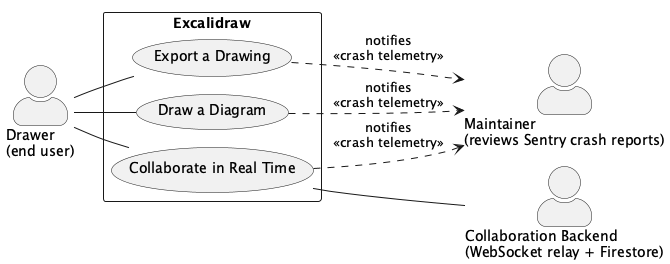

# Requirements and Use Cases

Repository analyzed: `github.com/mendozaa0130/excalidraw` (fork of `excalidraw/excalidraw`), `@excalidraw/excalidraw` v0.18.0, commit `982d3842`.

## Part 1: Requirements (FURPS+)

### Functional

**FR-1: The system shall let a user create, resize, and restyle shape, text, arrow, and freehand elements directly on a canvas.**
Evidence: `packages/element/src/types.ts` defines the element type union — `"rectangle"`, `"diamond"`, `"ellipse"`, `"arrow"`, `"line"`, `"text"`, `"freedraw"`, `"image"`, `"frame"` (lines 94–432). Element creation and resizing are driven from pointer events in `packages/excalidraw/components/App.tsx` (`handleCanvasPointerDown`, line 8474), and each committed change is pushed onto the undo stack via `this.history.record(...)` (`App.tsx:3808`).

**FR-2: The system shall support real-time multi-user collaboration on the same drawing.**
Evidence: `excalidraw-app/collab/Collab.tsx` implements `startCollaboration` (line 481), which generates a room id/key (`generateCollaborationLinkData`), lazily loads `socket.io-client` (line 519), and relays updates with `this.portal.broadcastScene(WS_SUBTYPES.UPDATE, ...)` (line 965). `excalidraw-app/package.json` lists `socket.io-client` and `firebase` as dependencies.

### Usability

**UR-1: The system shall provide a discoverable, in-app reference of every keyboard shortcut and interaction gesture.**
Evidence: `packages/excalidraw/components/HelpDialog.tsx` renders a `ShortcutIsland` (line 69) populated from `getShortcutKey` (`packages/excalidraw/shortcut.ts`) for every tool and command (e.g. `CtrlOrCmd+K`, `Shift+Enter`, double-click-to-edit at line 239).

**UR-2: Interactive controls shall carry accessible names for assistive technology.**
Evidence: `packages/excalidraw/components/*.tsx` contains 39 files using `aria-label` on buttons/inputs (e.g. the error splash screen in `excalidraw-app/components/TopErrorBoundary.tsx:107` marks its warning icon with `role="img" aria-label="warning"`).

### Reliability

**RR-1: A single rendering/runtime crash shall not silently destroy the user's unsaved drawing, and shall be reported for follow-up.**
Evidence: `excalidraw-app/components/TopErrorBoundary.tsx` is a React error boundary (`componentDidCatch`, line 26) that (a) reports the exception to Sentry (`Sentry.captureException`, line 38), (b) dumps the current `localStorage` scene state into the crash screen so the user can recover/inspect their data (lines 27–44, 130–139), and (c) offers a one-click path to file a GitHub issue pre-filled with the Sentry event id (`createGithubIssue`, line 55).

**RR-2: The current drawing shall persist across reloads without an explicit save action.**
Evidence: `excalidraw-app/data/localStorage.ts` and `packages/excalidraw/data/EditorLocalStorage.ts` persist scene/app state to `localStorage` continuously as the canvas changes, which is what `TopErrorBoundary` reads back from on a crash.

### Performance

**PR-1: Canvas re-rendering during drawing and collaboration updates shall be throttled to at most one paint per animation frame.**
Evidence: `packages/excalidraw/reactUtils.ts` and `@excalidraw/common` export `throttleRAF`, used to define `renderStaticSceneThrottled` (`packages/excalidraw/renderer/staticScene.ts:519`) and `renderNewElementSceneThrottled` (`packages/excalidraw/renderer/renderNewElementScene.ts:95`), so that pointer-driven and network-driven scene mutations are coalesced to the browser's paint cycle instead of re-rendering on every event.

### Supportability

**SR-1: The UI text shall be externalized and translatable, and the project shall accept community-contributed translations.**
Evidence: `packages/excalidraw/locales/` contains 59 locale JSON files (e.g. `ar-SA.json`, `bn-IN.json`); `packages/excalidraw/i18n.ts` implements the `t()`/`Trans` lookup used throughout the component tree (e.g. `TopErrorBoundary.tsx:2`). Commit `0361bdd9` ("Update translations from Crowdin") shows an automated Crowdin sync pipeline feeding these files.

### The "+" (implementation constraints, external interfaces, licensing)

**PLUS-1: The project is distributed under the MIT license, and any interface added to the published package must remain compatible with that license.**
Evidence: `LICENSE` at the repo root, "MIT License, Copyright (c) 2020 Excalidraw."

**PLUS-2: Collaboration data relayed through the (untrusted) WebSocket/Firestore backend must be end-to-end encrypted so the backend operator cannot read scene content.**
Evidence: `packages/excalidraw/data/encryption.ts` generates an AES-GCM `CryptoKey` (`window.crypto.subtle.generateKey`, line 17) and implements `encryptData`/`decryptData` (lines 50–90) around `AES-GCM`; the root `README.md` advertises the product as "Collaborative and end-to-end encrypted."

## Part 2: Actors

- **Primary actor — Drawer (end user):** the person using the Excalidraw canvas in the browser to sketch, edit, and share diagrams; this is whoever operates `packages/excalidraw/components/App.tsx` through the UI.
- **Supporting actor — Collaboration Backend (WebSocket relay + Firestore):** the `socket.io` room server and Firebase Firestore store that `excalidraw-app/collab/Collab.tsx`/`Portal.tsx` talk to; it relays and stores each collaborator's encrypted scene updates so the system can offer live collaboration.
- **Offstage actor — Maintainer (via Sentry crash reports):** an Excalidraw maintainer who never touches a live drawing session but cares that the app doesn't crash; they review the exceptions `TopErrorBoundary.tsx` reports to Sentry after the fact and triage the GitHub issues users file from the crash screen.

## Part 3: Brief Use Cases

**Draw a Diagram** — A Drawer opens the canvas, picks a tool, and sketches out shapes, arrows, and text until the diagram says what they want, resizing and restyling elements as they go and undoing any mistakes. Implemented in `packages/excalidraw/components/App.tsx` (pointer-event handlers and history stack) and `packages/element`.

**Collaborate in Real Time** — A Drawer shares a collaboration link with teammates so everyone can edit the same drawing at once, seeing each other's cursors and changes appear live until they've finished working together. Implemented in `excalidraw-app/collab/Collab.tsx` and `excalidraw-app/collab/Portal.tsx`.

**Export a Drawing** — A Drawer takes a finished diagram out of the browser tab, as a PNG/SVG image or a copy on the clipboard, so it can be pasted into a doc, ticket, or presentation. Implemented in `packages/excalidraw/components/ImageExportDialog.tsx` and `packages/excalidraw/scene/export.ts`.

## Part 4: Fully-Dressed Use Cases

### Use Case: Draw a Diagram

**Primary Actor:** Drawer

**Stakeholders and Interests:**
- Drawer: wants to translate an idea into a visual diagram quickly, without losing work to a mistake or a crash.
- Maintainer: wants crashes during editing to be reported automatically rather than silently losing the user's diagram.

**Preconditions:** The Excalidraw app has loaded in the browser and the canvas is visible.

**Success Guarantee:** The new/edited element is part of the scene, is drawn on the canvas, is persisted to `localStorage`, and is on the undo history stack.

**Main Success Scenario:**
1. The Drawer selects a drawing tool (e.g. rectangle, arrow, text, freedraw) from the toolbar.
2. The Drawer presses the pointer down on the canvas at the desired starting point.
3. The system creates a new element of the selected type at that position (`handleCanvasPointerDown`).
4. The Drawer drags the pointer to size/shape the element.
5. The system updates the element's geometry and repaints the canvas on each animation frame (`renderNewElementSceneThrottled`).
6. The Drawer releases the pointer to finish the element.
7. The system finalizes the element, records the change on the undo history stack, and persists the updated scene to `localStorage`.

**Extensions:**
- **1a. The Drawer selects the text tool instead of a shape tool:**
  1. The system opens an inline text-editing cursor on click instead of a drag-to-size interaction, and commits the text element when the Drawer presses `Escape` or `Ctrl/Cmd+Enter`.
- **6a. The Drawer presses `Escape` before releasing the pointer:**
  1. The system discards the in-progress element and does not add it to the scene or the undo stack.
- **7a. The Drawer immediately presses `Ctrl/Cmd+Z`:**
  1. The system pops the last entry off the undo history stack and removes the element from the scene.
- **7b. A rendering exception occurs while committing the element:**
  1. `TopErrorBoundary` catches the error, reports it to Sentry, and shows a crash screen containing the last-persisted `localStorage` scene contents for recovery.

**Special Requirements:** Canvas repaints triggered by this use case must be throttled to the browser's animation frame (see PR-1).

**Implemented in:** `packages/excalidraw/components/App.tsx`, `packages/excalidraw/renderer/renderNewElementScene.ts`, `packages/element`, `excalidraw-app/data/localStorage.ts`.

---

### Use Case: Collaborate in Real Time

**Primary Actor:** Drawer

**Stakeholders and Interests:**
- Drawer (host): wants to invite others into their drawing session and see their edits live.
- Drawer (collaborator): wants their edits and cursor to appear to everyone else in the room promptly.
- Collaboration Backend: needs a valid room id/key to relay or store any scene data.
- Maintainer: wants encryption failures or dropped connections surfaced as crash reports, not silent data loss.

**Preconditions:** The Excalidraw app has loaded and at least one Drawer has an existing scene open.

**Success Guarantee:** All participants in the room share a synchronized scene, and no scene data is stored or relayed by the backend in plaintext.

**Main Success Scenario:**
1. The Drawer (host) opens the Share dialog and selects "Live collaboration" (`ShareDialog.tsx`).
2. The system generates a room id and an AES-GCM encryption key (`generateCollaborationLinkData`) and produces a shareable collaboration link containing them.
3. The system dynamically imports the `socket.io-client` library and opens a WebSocket connection to the Collaboration Backend, joining the generated room.
4. The Drawer shares the link with a teammate, who opens it in their own browser.
5. The joining collaborator's client extracts the room id/key from the link and opens its own WebSocket connection into the same room.
6. An existing member of the room broadcasts the current encrypted scene to the new joiner over the socket; the joining client decrypts it and initializes its canvas from it (`initializeRoom`).
7. As either Drawer edits the scene, the system encrypts the changed elements and broadcasts them to the room (`portal.broadcastScene`, `WS_SUBTYPES.UPDATE`).
8. Each client in the room decrypts incoming updates and merges them into its local scene, repainting the canvas.

**Extensions:**
- **1a. The host is the very first person in the room (`"first-in-room"` socket event):**
  1. There is no peer to broadcast a scene, so the system fetches the last-saved encrypted scene for that room from Firebase (`initializeRoom({ fetchScene: true })`) instead, or seeds the room from the host's current local scene if none exists yet.
- **4a. No teammate ever opens the link:**
  1. The session remains active with only the host present; no further steps occur until someone joins or the host ends collaboration.
- **6a. No peer responds with the initial scene broadcast within 5 seconds, or the socket connection errors immediately (`connect_error`):**
  1. The system falls back to fetching the room's last-saved encrypted scene directly from Firebase (`fallbackInitializationHandler` → `initializeRoom({ fetchScene: true })`) instead of waiting on a peer.

**Special Requirements:** All scene data leaving the browser must be AES-GCM encrypted before being sent to the Collaboration Backend (see PLUS-2).

**Implemented in:** `excalidraw-app/collab/Collab.tsx`, `excalidraw-app/collab/Portal.tsx`, `packages/excalidraw/data/encryption.ts`.

---

### Use Case: Export a Drawing

**Primary Actor:** Drawer

**Stakeholders and Interests:**
- Drawer: wants to get their finished diagram out of the browser tab in a usable format.
- Maintainer: wants export failures caught and reported rather than producing a corrupt/blank file silently.

**Preconditions:** The scene contains at least one element the Drawer wants to export (or the Drawer accepts exporting an empty canvas).

**Success Guarantee:** The requested image file is either downloaded to disk or copied to the system clipboard, matching the current appearance of the (selected) elements.

**Main Success Scenario:**
1. The Drawer opens the export dialog (`ImageExportDialog`).
2. The system renders a live preview of the exportable elements (selection, or the whole scene if nothing is selected).
3. The Drawer chooses export options (background on/off, padding, scale).
4. The Drawer clicks the download action.
5. The system rasterizes/serializes the scene via `exportToCanvas`/`exportToSvg` (`packages/excalidraw/scene/export.ts`) and `exportToBlob` (`packages/utils/src/export.ts`).
6. The system triggers a browser file download of the resulting PNG/SVG file.

**Extensions:**
- **4a. The Drawer clicks the copy-to-clipboard action instead of download:**
  1. The system writes the exported image blob to the system clipboard instead of downloading a file.
- **1a. Nothing in the scene is selected and the scene is empty:**
  1. The export dialog preview shows a blank canvas; the Drawer may cancel instead of proceeding to step 3.
- **5a. The canvas-to-blob conversion fails because the export is too large (`CANVAS_POSSIBLY_TOO_BIG`):**
  1. The export dialog shows a "canvas too big" error message (`setRenderError`) instead of a preview, and the download/copy actions are not available.

**Special Requirements:** None beyond FR-1 (the exported image must reflect the current on-canvas appearance of each element).

**Implemented in:** `packages/excalidraw/components/ImageExportDialog.tsx`, `packages/excalidraw/scene/export.ts`, `packages/utils/src/export.ts`.

## Part 5: Use Case Diagram

Source: [`docs/use-case-diagram.puml`](use-case-diagram.puml) (PlantUML). Rendered:

