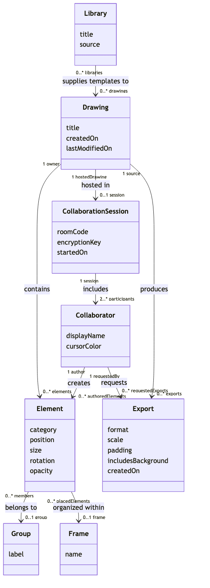
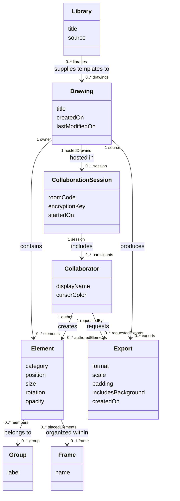
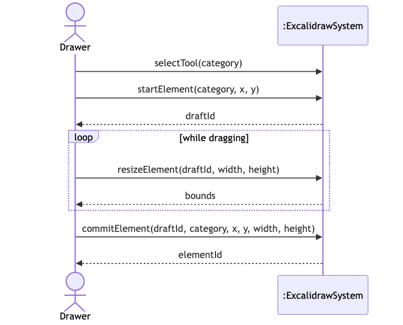
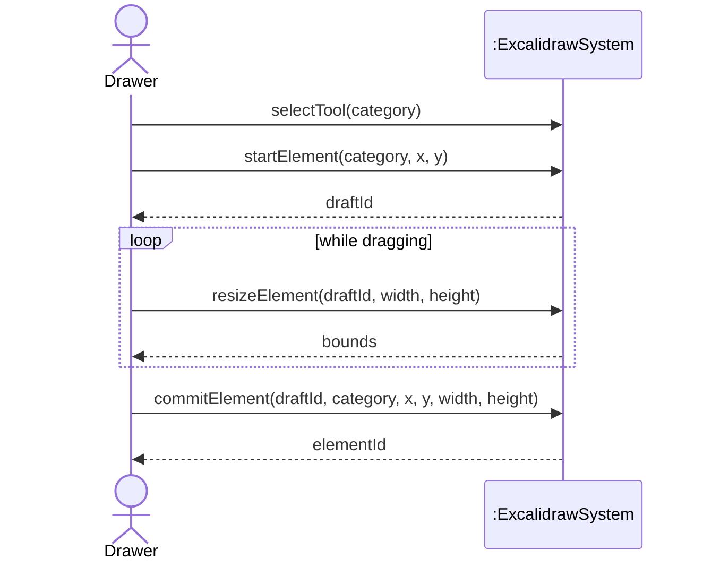
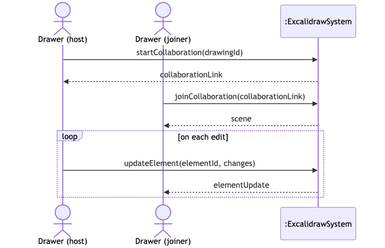
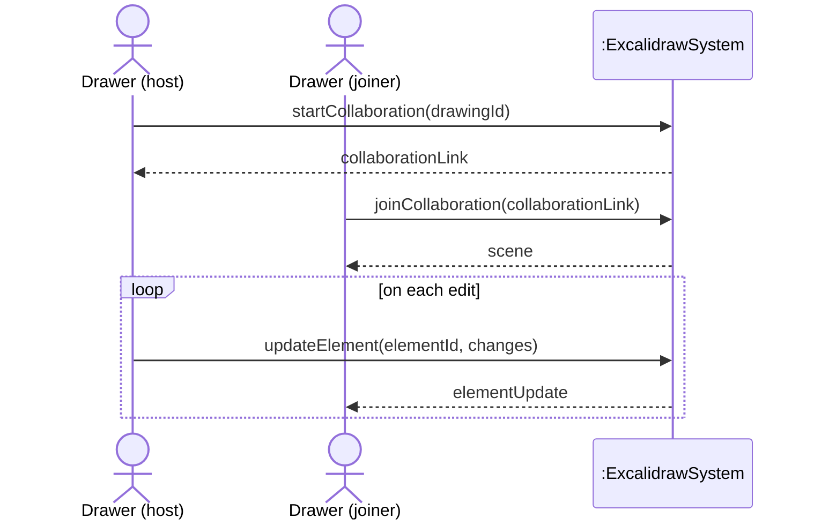
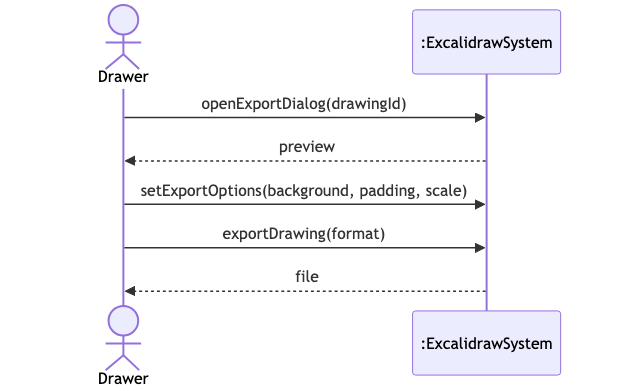
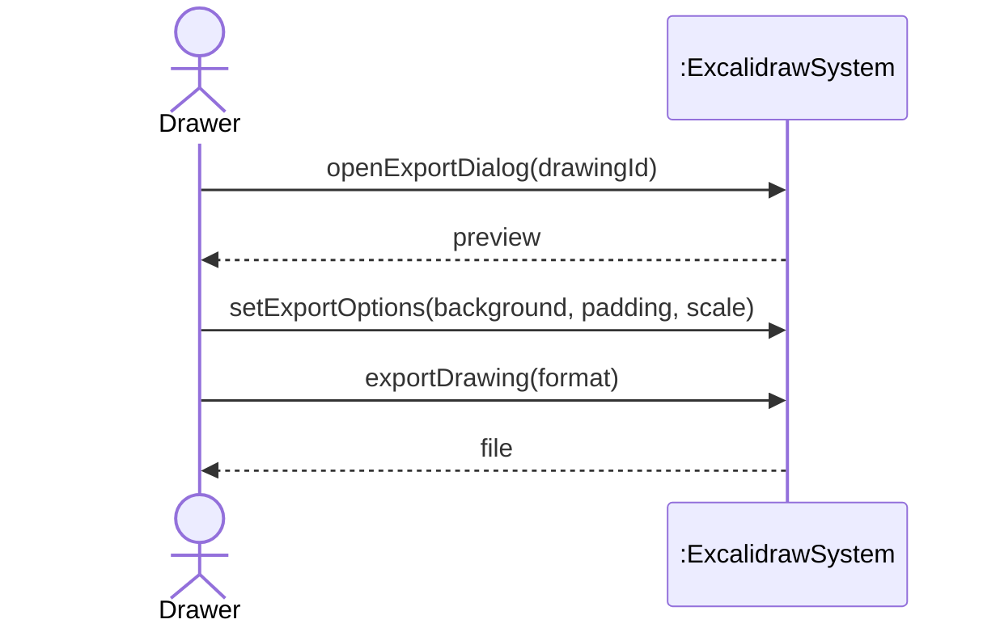

# SSDs and Operation Contracts

Repository analyzed: `github.com/mendozaa0130/excalidraw` (fork of `excalidraw/excalidraw`), `@excalidraw/excalidraw` v0.18.0. Builds on the three fully-dressed use cases (Draw a Diagram, Collaborate in Real Time, Export a Drawing) and the domain model from the prior assignments.

## Part 1: Tighten the Domain Model

### Noun Phrase Analysis

Noun phrases are pulled from the Preconditions, Success Guarantee, Main Success Scenario, and Extensions of each fully-dressed use case (not from the Stakeholders/Interests text, which describes goals rather than domain state). Repeated phrases are listed once, with every use case they appear in.

| Noun phrase | Found in | Decision | Why |
|---|---|---|---|
| Drawer | All three UCs, throughout | Conceptual class | Maps to the existing **Collaborator** class — a real person authoring/viewing a drawing |
| Excalidraw app / the system | Draw a Diagram (precond.); all UCs | Neither | This is the system boundary itself, not something inside the domain |
| browser | Draw a Diagram (precond.); Collaborate (step 4) | Neither | Runtime platform, not a domain concept |
| canvas | Draw a Diagram (steps 2, 4, 5); Export (precond., ext. 1a) | Neither | The UI drawing surface — interface, not domain |
| drawing tool (rectangle, arrow, text, freedraw) | Draw a Diagram (step 1) | Neither | UI tool selection; the resulting concept is already `Element.category` |
| toolbar | Draw a Diagram (step 1) | Neither | User interface |
| pointer | Draw a Diagram (steps 2, 4, 6) | Neither | Input gesture, not a domain object |
| starting point / position | Draw a Diagram (steps 2, 3) | Attribute of Element | Just a coordinate — already `Element.position` |
| element (new element) | Draw a Diagram (step 3, Success Guarantee); ext. 6a | Conceptual class | Already in the domain model as **Element** |
| element's geometry (size/shape) | Draw a Diagram (steps 4, 5) | Attribute of Element | A dimension describing the element, not an object of its own — model was missing this |
| animation frame | Draw a Diagram (step 5) | Neither | A rendering/timing detail |
| undo history stack / last entry | Draw a Diagram (step 7; ext. 7a) | Neither | An editor implementation mechanism (a stack), not a business entity the Drawer names or manages directly |
| localStorage | Draw a Diagram (step 7, Success Guarantee) | Neither | Browser storage mechanism — implementation, not domain |
| text tool / inline text-editing cursor | Draw a Diagram (ext. 1a) | Neither | UI interaction; the concept is already `Element.category = "text"` |
| Escape / Ctrl+Enter | Draw a Diagram (ext. 1a, 6a) | Neither | Keyboard input |
| rendering exception | Draw a Diagram (ext. 7b) | Neither | A software fault, not a domain concept |
| crash screen | Draw a Diagram (ext. 7b) | Neither | User interface |
| Sentry | Draw a Diagram (ext. 7b) | Neither | Third-party external system (proper noun) |
| scene | Collaborate (throughout) | Conceptual class | Same real-world thing as **Drawing** — confirms the existing class |
| room | Collaborate (throughout) | Conceptual class | Same real-world thing as **CollaborationSession** — confirms the existing class |
| Collaboration Backend | Collaborate (precond., Success Guarantee, throughout) | Neither | An external supporting actor/system, not a class the domain model tracks data about |
| Share dialog | Collaborate (step 1) | Neither | User interface |
| room id | Collaborate (step 2) | Attribute of CollaborationSession | Matches the existing `roomCode` attribute |
| encryption key (AES-GCM) | Collaborate (step 2) | Attribute of CollaborationSession | A key string the session holds — model was missing this |
| collaboration link | Collaborate (steps 2, 4, 5) | Neither | A derived, shareable URL built from `roomCode` + `encryptionKey`; not separately stored state |
| socket.io-client library | Collaborate (step 3) | Neither | Third-party software library |
| WebSocket connection | Collaborate (steps 3, 5; ext. 6a) | Neither | A network/software mechanism |
| teammate / member (of room) | Collaborate (steps 4, 6) | Conceptual class | Same real-world thing as **Collaborator** |
| joining collaborator's client | Collaborate (steps 5, 6) | Neither | The software client, not the person — the person is already **Collaborator** |
| Firebase | Collaborate (ext. 1a, 6a) | Neither | Third-party external storage service (proper noun) |
| 5 seconds (timeout) | Collaborate (ext. 6a) | Neither | A technical/performance parameter, not an attribute of a business object |
| export dialog | Export (step 1) | Neither | User interface |
| live preview | Export (step 2) | Neither | Transient UI rendering |
| selection / selected elements | Export (step 2) | Neither | A transient, per-viewer interaction state — not a stored property of the Element itself |
| export options (background, padding, scale) | Export (step 3) | Attribute of Export | Plain values describing one export request |
| download action / copy-to-clipboard action | Export (step 4; ext. 4a) | Neither | UI controls |
| image file / PNG or SVG file / exported image blob | Export (steps 4–6, Success Guarantee; ext. 4a) | Conceptual class | A real artifact the Drawer produces and keeps outside the app — the model had nothing for this; added new class **Export** |
| disk | Export (step 6) | Neither | External OS resource |
| system clipboard | Export (Success Guarantee; ext. 4a) | Neither | External OS resource |
| canvas-to-blob conversion | Export (ext. 5a) | Neither | Implementation step |
| "canvas too big" error message | Export (ext. 5a) | Neither | UI feedback text — a message shown is not a domain fact |

### Updated Domain Model

Source: [`docs/domain-model.mmd`](domain-model.mmd), rendered at [`docs/domain-model.png`](domain-model.png).

### What Changed and Why

The model gained one new conceptual class, Export, and two new attributes on existing classes. Export a Drawing refers repeatedly to "the resulting PNG or SVG file," a real artifact the Drawer produces and keeps outside the app, but the previous model had nothing to represent it. I added Export with format, scale, padding, and includesBackground, associated to the Drawing it is produced from and the Collaborator who requests it. Element gained a size attribute, because sizing the shape is central to Draw a Diagram. CollaborationSession gained an encryptionKey attribute, because Collaborate in Real Time generates the key and depends on it. Other noun phrases that seemed class-like, such as the undo history stack, WebSocket connection, collaboration link, and element selection, were left out because they are UI or implementation mechanisms rather than domain concepts.

## Part 2: System Sequence Diagrams

Each SSD shows only the primary actor, the system as a single black box (`:ExcalidrawSystem`), and the events of the use case's Main Success Scenario — named as operations the system performs, not as clicks or UI widgets. Return values are dashed arrows; repeated steps are wrapped in a loop box.

### SSD: Draw a Diagram

`startElement` corresponds to MSS step 3 and returns a `draftId` — while the Drawer is dragging, the shape is only a draft, not yet part of the Drawing. The loop covers steps 4–5 (dragging repeatedly resizes the draft). `commitElement` corresponds to step 7: this is the point where the system actually creates the Element in the domain, records it on the undo stack, and persists the scene, so it carries the draft's final category/position/size and returns the new Element's real `elementId`.

Source: [`docs/ssd-draw-a-diagram.mmd`](ssd-draw-a-diagram.mmd).

### SSD: Collaborate in Real Time

This use case has two Drawer instances — the host who starts the session and the teammate who joins it — so both appear as separate actor lifelines rather than inventing a second actor type. `startCollaboration` covers MSS steps 1–3 (opening the dialog, generating the room/key, opening the connection); `joinCollaboration` covers steps 4–6 (the teammate enters via the link and receives the synchronized scene); the loop covers steps 7–8 (each edit is relayed to the other participant).

Source: [`docs/ssd-collaborate-in-real-time.mmd`](ssd-collaborate-in-real-time.mmd).

### SSD: Export a Drawing

`openExportDialog` corresponds to MSS steps 1–2 (opening the dialog and rendering the preview); `setExportOptions` corresponds to step 3; `exportDrawing` corresponds to steps 4–6 (rasterizing/serializing the scene and returning the resulting file). This use case has no repeated step, so no loop box is needed.

Source: [`docs/ssd-export-a-drawing.mmd`](ssd-export-a-drawing.mmd).

## Part 3: Operation Contracts

One state-changing event was picked from each SSD. All classes and attributes named below already exist in the Part 1 domain model.

### Operation: commitElement(draftId: DraftID, category: String, x: Number, y: Number, width: Number, height: Number)

**Cross-references:** Use case Draw a Diagram

**Preconditions:**
- A Drawing is open for editing by a Collaborator
- draftId identifies an in-progress shape that Collaborator is drawing, not yet part of the Drawing

**Postconditions:**
- An Element instance was created
- Element.category was set to category
- Element.position was set to (x, y)
- Element.size was set to (width, height)
- The Element was associated with the Drawing (contains)
- The Element was associated with the Collaborator as its author (creates)

### Operation: startCollaboration(drawingId: DrawingID)

**Cross-references:** Use case Collaborate in Real Time

**Preconditions:**
- A Drawing with drawingId exists and is open for a Collaborator (the host)
- The Drawing is not already hosted in an active CollaborationSession

**Postconditions:**
- A CollaborationSession instance was created
- CollaborationSession.roomCode was set to a newly generated value
- CollaborationSession.encryptionKey was set to a newly generated value
- CollaborationSession.startedOn was set to now
- The CollaborationSession was associated with the Drawing (hosted in)
- The host Collaborator was associated with the CollaborationSession (includes)

### Operation: exportDrawing(format: String)

**Cross-references:** Use case Export a Drawing

**Preconditions:**
- A Drawing is open for a Collaborator, and export options (background, padding, scale) were already set for it via setExportOptions
- The Drawing contains at least one Element, or the Collaborator has accepted exporting an empty Drawing

**Postconditions:**
- An Export instance was created
- Export.format was set to format
- Export.scale was set to the value chosen via setExportOptions
- Export.padding was set to the value chosen via setExportOptions
- Export.includesBackground was set to the value chosen via setExportOptions
- Export.createdOn was set to now
- The Export was associated with the Drawing (produces)
- The Export was associated with the Collaborator (requests)